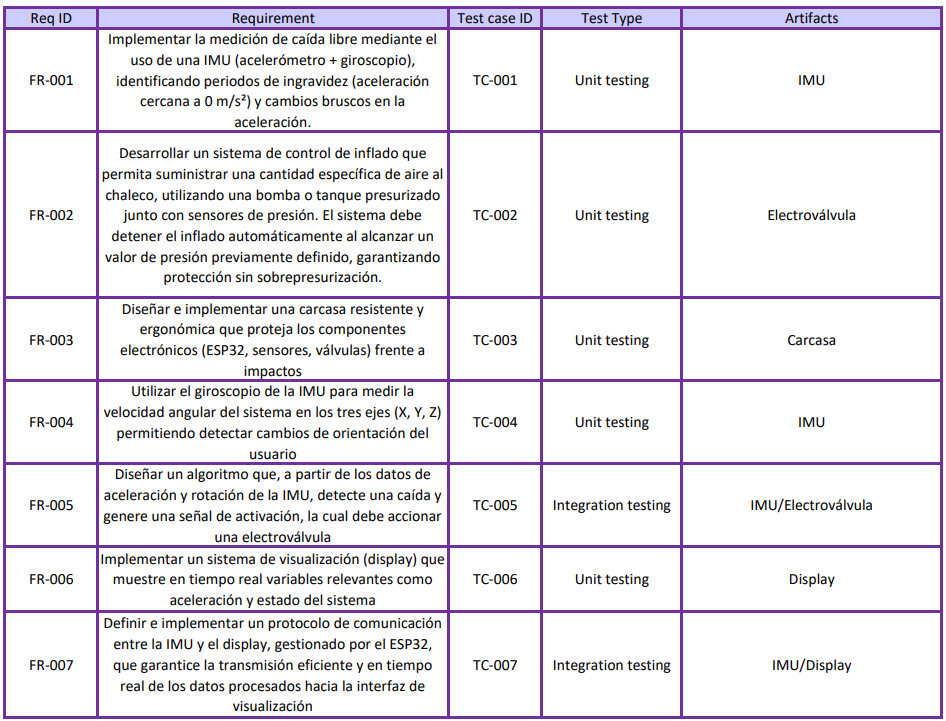
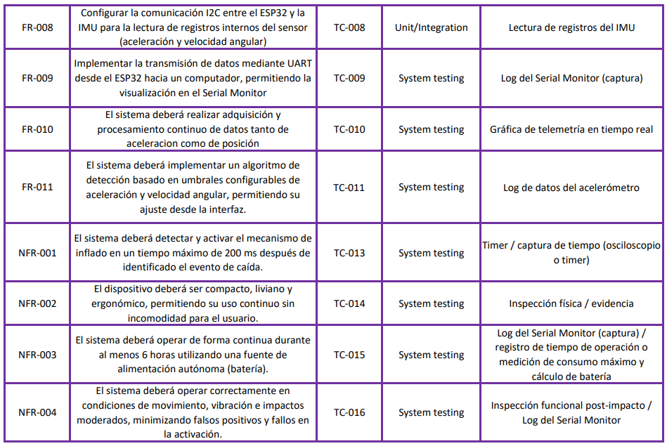

# Proyecto SEPAC

Sistema Embebido de Protección Activa ante Caídas 

## Roles

Technical Lead: Sebastian Palacio Barrientos 

Firmware Engineer: Sarha Cifuentes Montoya 

Hardware Integration Engineer: Maria Isabel Ríos Jaramillo 

Verification & Testing Engineer: Natalia Díaz Villamil 

## Introducción 
En la actualidad, el desarrollo de tecnologías de seguridad personal basadas en sistemas embebidos ha cobrado una relevancia crítica, especialmente en áreas donde la integridad física depende de la respuesta inmediata ante accidentes. Las caídas representan uno de los riesgos más significativos tanto en entornos industriales de alto riesgo como en el cuidado de poblaciones vulnerables. Ante esta problemática, la integración de sensores inerciales y microcontroladores de alto rendimiento permite la creación de dispositivos capaces de monitorear el movimiento humano con una precisión sin precedentes, ofreciendo la posibilidad de intervenir activamente antes del impacto. 

Este proyecto propone el diseño y la implementación de un sistema embebido portátil centrado en el microcontrolador ESP32, cuya función principal es la detección de caídas mediante el análisis en tiempo real de la aceleración y la orientación del usuario. A través del uso de un acelerómetro y un giroscopio, el sistema identifica patrones cinemáticos característicos, como periodos de ingravidez o cambios abruptos en la magnitud de la aceleración. A diferencia de los sistemas de monitoreo pasivos, esta solución integra una etapa de respuesta activa mediante un circuito de potencia diseñado para accionar una bomba de aire, la cual infla un chaleco protector de manera instantánea al detectar un evento crítico. 

El control del sistema no se limita únicamente a la activación del actuador; la arquitectura incluye una gestión inteligente de la presión mediante sensores específicos que garantizan que el inflado se detenga en el punto óptimo de operación. Asimismo, la robustez del dispositivo se complementa con una capacidad de registro de datos interno y un módulo de comunicación inalámbrica. Esto permite que la información recolectada sea transmitida a una interfaz gráfica de usuario en un computador, facilitando la visualización de variables en tiempo real, la configuración de umbrales de sensibilidad y la supervisión de posibles errores en el funcionamiento del hardware. 

Finalmente, el desarrollo contempla la integración física de los componentes en una tarjeta electrónica ensamblada y protegida por una carcasa portátil diseñada ergonómicamente. Este enfoque integral busca demostrar la viabilidad de un sistema autónomo y eficiente que combine el procesamiento de señales inerciales con la electrónica de potencia. El resultado final es un prototipo funcional que cumple con requerimientos técnicos estrictos, orientado a mitigar las consecuencias de las caídas mediante una respuesta automatizada, confiable y tecnológicamente avanzada. 

## Objetivo general
Desarrollar un sistema embebido controlado con ESP32, el cual, a partir de sensores como un acelerómetro y un giroscopio, permita que se infle un chaleco con aire a presión cuando se detecten cambios bruscos en la aceleración.  

## Objetivos específicos 
● Diseñar un circuito con ESP 32 que reciba de entrada la información de un acelerómetro y un giroscopio que cuando estos sobrepasen un rango determinado, se genere una salida para controlar un circuito de potencia y simultáneamente, se genere otra salida que permita que los datos sean guardados y mostrados en una interfaz gráfica. 

 

 ● Diseñar un circuito de potencia que active un tanque de aire comprimido que por medio de una electroválvula infle un chaleco con una cantidad previamente establecida. 

 

 ● Construir una carcasa en donde el usuario pueda utilizar los sensores, de forma que estos registren los cambios en la aceleración significativos. 

 ● Caracterizar los requerimientos funcionales y no funcionales que deben cumplir todos los sensores y actuadores del circuito. 

 ## Alcance del proyecto
 Para este proyecto se busca hacer el diseño e implementación de un dispositivo detección de caídas, alojando su funcionamiento en una tarjeta electrónica con fuente de energía independiente (batería recargable o baterías intercambiables). Para su correcto funcionamiento deberá operar en tiempo real, midiendo la aceleración y orientación del usuario mientras permanezca encendido. Se desarrollará un algoritmo de detección de caídas basado en características físicas, a partir de estas mediciones, será capaz de identificar patrones característicos asociados a eventos de caída, si el sistema detecta una caída potencial enviará  por medio de un módulo de comunicación inalámbrica alertas que representaran el aviso de una caída y en simultaneo este aviso liberará el flujo de aire desde un tanque presurizado hacia el chaleco del usuario, con el objetivo de amortiguar el impacto, actuando como un sistema de airbag. Por este motivo el dispositivo deberá ser encapsulado en una carcasa lo suficientemente fuerte para resistir altos impactos, con el fin de garantizar la integridad del sistema electrónico y prolongar su vida útil. 

Este proyecto tiene como público primario, personas mayores o de movilidad reducida, que viven de forma independiente o en un entorno asistencial (hogares geriátricos, hospitales), ya que esta población es más propensa a caídas frecuentes y de mayor riesgo. Además, también busca facilitar la vida del personal médico o cuidador del usuario, reduciendo daños con una detección temprana. 

Otros de los entornos a los que va dirigido es a la supervisión de pacientes encamados o en etapa posoperatoria, deportistas o trabajadores en actividades de riesgo. En esencia se busca disminuir riesgos ante diversas situaciones de vulnerabilidad física en entornos más amplios o remotos. 

## Requerimientos

